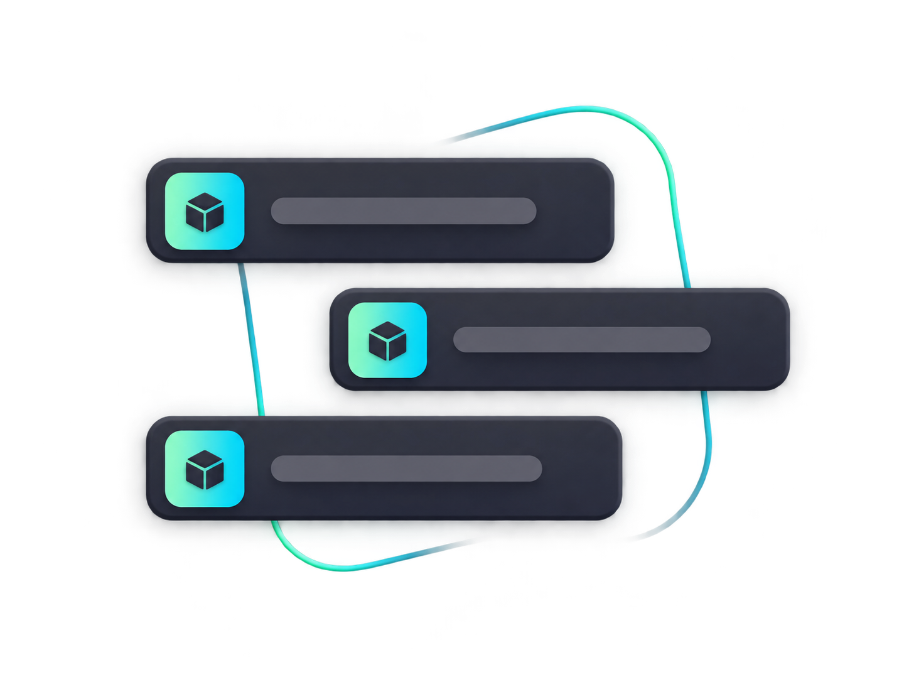
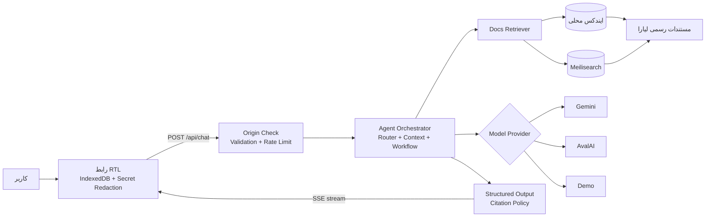
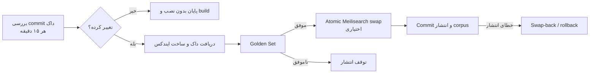

<a id="top"></a>

<div align="center">
  

  <h1>دستیار مستندات لیارا</h1>

  <p>
    <strong>پاسخ مستند، منبع روشن، قدم بعدی مشخص</strong>
  </p>
  <p>
    A Persian-first, citation-aware AI assistant for Liara documentation
  </p>

  <p>
    
    
    
    
    
    
  </p>

  <p>
    <a href="#fa">فارسی</a>
    ·
    <a href="#english">English</a>
    ·
    <a href="https://github.com/iTzYasin/liara">GitHub</a>
    ·
    <a href="https://docs.liara.ir/">Liara Docs</a>
  </p>

  
</div>
<a id="fa"></a>

<div dir="rtl">

> [!NOTE]
> این پروژه یک دستیار فارسی مبتنی بر RAG است: سؤال را می‌فهمد، بخش‌های مرتبط مستندات رسمی لیارا را پیدا می‌کند، پاسخ را به‌صورت زنده می‌نویسد و هر ادعای فنی را به منبع قابل بررسی متصل می‌کند.

| 📚 ایندکس مستندات | 🧩 قطعه‌های قابل جست‌وجو | 🧪 سناریوی ارزیابی | 🎯 Recall@8 |
|:---:|:---:|:---:|:---:|
| **۱٬۱۴۳ سند** | **۳٬۴۵۴ chunk** | **۱۳۰ سناریو** | **۱۰۰٪** |

<sub>اعداد بالا مربوط به ایندکس commit‌شده با شناسه `5704e2d` هستند. Recall@8، پوشش ارجاع و عدم نشت ارجاع نامعتبر با `npm run golden:eval` بررسی شده‌اند.</sub>

## فهرست

- [معرفی](#fa-overview)
- [نمای محصول](#fa-preview)
- [قابلیت‌ها](#fa-features)
- [شروع سریع](#fa-quick-start)
- [معماری](#fa-architecture)
- [مستندات و جست‌وجو](#fa-retrieval)
- [امنیت و حریم داده](#fa-security)
- [تنظیمات محیطی](#fa-config)
- [آزمون و کیفیت](#fa-quality)
- [استقرار](#fa-deploy)
- [ساختار پروژه](#fa-structure)
- [محدودیت‌های فعلی](#fa-limitations)
- [مشارکت](#fa-contributing)
- [English](#english)

<a id="fa-overview"></a>

## دستیار چه مسئله‌ای را حل می‌کند؟

پیداکردن یک پاسخ دقیق در مستندات فنی معمولاً فقط «جست‌وجوی یک کلمه» نیست؛ کاربر ممکن است لاگ خطا، فایل پیکربندی یا یک هدف چندمرحله‌ای داشته باشد. این دستیار برای همان فاصله میان سؤال واقعی کاربر و ساختار مستندات ساخته شده است.

مسیر اصلی محصول ساده است:

1. کاربر سؤال، لاگ، تصویر، PDF یا فایل متنی را می‌فرستد.
2. اطلاعات حساس در مرورگر و دوباره روی سرور ماسک می‌شوند.
3. Agent نوع درخواست و ادامه مناسب مکالمه را تشخیص می‌دهد.
4. Retriever بهترین بخش‌های داک رسمی را از ایندکس محلی یا Meilisearch پیدا می‌کند.
5. مدل پاسخ مرحله‌ای تولید می‌کند و Citation Policy ادعاها و منابع را کنترل می‌کند.
6. پاسخ با SSE نمایش داده می‌شود و جزئیات هر منبع در پنل کناری قابل مشاهده است.

> [!IMPORTANT]
> این برنامه به حساب لیارا، سرویس‌ها، لاگ‌های پنل یا سامانه تیکت کاربر دسترسی مستقیم ندارد. دامنه پاسخ فقط مستندات رسمی و داده‌ای است که خود کاربر در گفتگو وارد می‌کند.

### مناسب برای

| 🚀 راه‌اندازی | 🧯 عیب‌یابی | 🧭 انتخاب مسیر | 📖 یادگیری |
|---|---|---|---|
| چک‌لیست استقرار و تنظیم سرویس | تحلیل لاگ و یافتن صفحه مرتبط | مقایسه گزینه‌های مستند و قدم بعدی | توضیح ساده مفاهیم با منبع |
| Next.js، Docker، دیتابیس و دامنه | خطاهای اتصال، SSL، build و runtime | ادامه سناریوهای چندمرحله‌ای | لینک مستقیم به heading مرتبط |

<a id="fa-preview"></a>

## نمای محصول

<picture>
  <source media="(prefers-color-scheme: dark)" srcset="./public/demo/liara-assistant-banner-dark.png">
  
</picture>

<table>
  <tr>
    <td width="58%" dir="rtl">
      <strong>یک تجربه فارسی‌محور، نه صرفاً یک چت‌بات</strong>
      <br><br>
      رابط کاملاً RTL، تاریخچه محلی گفتگوها، پاسخ Streaming، کارت منبع، پنل Citation، Drag & Drop فایل و ورودی‌های زمینه‌دار از صفحه مستندات و پیشخوان در کنار هم کار می‌کنند.
      <br><br>
      پاسخ بدون پشتوانه به‌عنوان پاسخ قطعی نمایش داده نمی‌شود؛ اگر سند کافی وجود نداشته باشد، دستیار سؤال تکمیلی می‌پرسد یا پیش‌نویس تیکت آماده می‌کند.
    </td>
    <td width="42%" align="center">
      
    </td>
  </tr>
</table>

<a id="fa-features"></a>

## قابلیت‌های کلیدی

| قابلیت | توضیح |
|---|---|
| 🧠 **گفتگوی فارسی مبتنی بر RAG** | پاسخ بر پایه corpus نسخه‌بندی‌شده مستندات لیارا، نه حافظه آزاد مدل |
| 🔗 **ارجاع قابل ردیابی** | شماره منبع، عنوان، breadcrumb واقعی، heading، snippet و لینک صفحه رسمی |
| ⚡ **پاسخ زنده با SSE** | نمایش تدریجی پاسخ همراه با وضعیت بازیابی و تولید |
| 🧭 **مکالمه و Workflow چندمرحله‌ای** | نگه‌داری هدف، مراحل تأییدشده و ادامه طبیعی follow-upهای مبهم |
| 🛡️ **محافظت از Secret** | ماسک کلید، توکن، رمز و URL حساس در Client و Server |
| 📎 **فایل و تصویر** | حداکثر سه فایل و مجموع ۱۰ مگابایت؛ متن، کد، PDF و PNG/JPEG/WebP |
| 🗂️ **تاریخچه محلی** | ذخیره در IndexedDB، جست‌وجو، تغییر نام، حذف و خروجی Markdown ماسک‌شده |
| 🔎 **Retriever انعطاف‌پذیر** | ایندکس محلی بدون شبکه یا Meilisearch با fallback خودکار |
| 🤖 **چند Provider** | Gemini، AvalAI سازگار با OpenAI و مدل قطعی Demo |
| 📈 **مشاهده‌پذیری بدون محتوای حساس** | latency، cache، token، هزینه تخمینی، نسخه داک و feedback |
| 🧪 **Golden Set نسخه‌بندی‌شده** | ۱۳۰ سناریوی مستقیم، چندمرحله‌ای، عیب‌یابی، ابهام، escalation و امنیت |
| 🐳 **آماده استقرار** | خروجی standalone، Docker چندمرحله‌ای، کاربر non-root و health check |

<a id="fa-quick-start"></a>

## شروع سریع

### پیش‌نیاز

- Node.js نسخه **`20.19.x`**؛ قرارداد فعلی پروژه `>=20.19.0 <21` است.
- npm
- کلید Gemini یا AvalAI برای پاسخ واقعی؛ حالت Demo به کلید نیاز ندارد.

### ۱. دریافت و نصب

```bash
git clone https://github.com/iTzYasin/liara.git
cd liara
npm ci
```

### ۲. ساخت فایل محیطی

macOS / Linux:

```bash
cp .env.example .env.local
```

PowerShell:

```powershell
Copy-Item .env.example .env.local
```

برای اجرای فوری و بدون API key، در `.env.local` مقدار زیر را قرار دهید:

```dotenv
DEMO_MODE=true
```

### ۳. اجرا

```bash
npm run dev
```

برنامه روی [http://localhost:3000](http://localhost:3000) اجرا می‌شود.

| مسیر | کاربرد |
|---|---|
| `/` و `/docs` | شبیه‌سازی مستندات و ورود زمینه‌دار به دستیار |
| `/panel` | شبیه‌سازی پیشخوان و شروع سناریوی راه‌اندازی |
| `/assistant` | فضای اصلی گفتگو |
| `/healthz` | زنده‌بودن process |
| `/readyz` | آمادگی Provider و ایندکس |
| `/api/docs/status` | آمار و commit فعلی corpus |
| `/api/metrics` | شاخص‌های اجرایی بدون متن گفتگو و PII |

### اتصال مدل واقعی

<details>
<summary><strong>AvalAI</strong></summary>

```dotenv
DEMO_MODE=false
MODEL_PROVIDER=avalai
AVALAI_API_KEY=your-key
AVALAI_BASE_URL=https://api.avalai.ir/v1
AVALAI_MODEL=deepseek-v4-flash
```

</details>

<details>
<summary><strong>Google Gemini</strong></summary>

```dotenv
DEMO_MODE=false
MODEL_PROVIDER=gemini
GEMINI_API_KEY=your-key
GEMINI_MODEL=gemini-3.5-flash-lite
GEMINI_FALLBACK_MODEL=gemini-flash-lite-latest
```

مدل fallback فقط وقتی استفاده می‌شود که مدل اصلی پیش از تولید خروجی با خطای موقت متوقف شود.

</details>

> [!CAUTION]
> Secret را commit نکنید، داخل Docker image قرار ندهید و با پیشوند `NEXT_PUBLIC_` نسازید. کلیدها فقط باید در environment امن runtime تعریف شوند.

<a id="fa-architecture"></a>

## معماری



### تصمیم‌های مهم طراحی

- **Orchestrator کوچک:** قرارداد `streamAgentTurn` جریان اصلی را نگه می‌دارد و Provider، Retriever، امنیت و policy پشت interfaceهای جدا هستند.
- **LLM-first routing:** intent، نیاز به clarification، escalation و فعال‌شدن RAG از خروجی ساختاریافته مدل می‌آید.
- **Fail closed:** خروجی Router و پاسخ با JSON Schema کنترل می‌شوند؛ repair محدود است و citation ناشناخته یا ادعای بدون منبع حذف می‌شود.
- **Fallback در مرز مناسب:** خرابی Meilisearch به ایندکس محلی سالم برمی‌گردد و خرابی موقت مدل اصلی می‌تواند Provider fallback را فعال کند.
- **Context محدود و قابل ادامه:** ۱۲ پیام اخیر از Client ارسال می‌شوند؛ شش پیام با جزئیات در Prompt می‌مانند و تاریخچه قدیمی به حافظه فشرده تبدیل می‌شود.
- **Cache محافظه‌کار:** پاسخ فقط برای سؤال عمومیِ بدون history، فایل، Secret، خطا یا شناسه شخصی cache می‌شود.

<a id="fa-retrieval"></a>

## مستندات و جست‌وجو

نسخه رسمی داک از `liara-docs/public/llms` خوانده و به `data/liara-docs-index.json` تبدیل می‌شود. هر chunk یک `content_hash` پایدار، مسیر سند و breadcrumb واقعی دارد.

```bash
npm run docs:index   # ساخت دوباره ایندکس از clone موجود
npm run docs:sync    # دریافت آخرین داک رسمی و جایگزینی atomic ایندکس
npm run search:sync  # همگام‌سازی افزایشی Meilisearch
```

بدون `MEILI_URL`، برنامه کاملاً از ایندکس commit‌شده و بدون وابستگی شبکه استفاده می‌کند. با فعال‌بودن Meilisearch، همگام‌سازی فقط chunkهای تغییرکرده را upsert، موارد حذف‌شده را پاک و سپس index زنده و staging را atomic swap می‌کند.

### خط لوله همگام‌سازی



Workflow علاوه بر زمان‌بندی، رویداد `repository_dispatch` با نوع `liara-docs-updated` را هم می‌پذیرد.

<a id="fa-security"></a>

## امنیت و حریم داده

| لایه | کنترل |
|---|---|
| مرورگر | ماسک Secret پیش از ارسال، تاریخچه محلی IndexedDB و export فقط از نسخه ماسک‌شده |
| ورودی فایل | محدودیت تعداد/حجم، allowlist نوع فایل و تطبیق MIME با Magic Byte |
| API | اعتبارسنجی body، بررسی Origin، محدودیت اندازه و rate limit |
| هویت محدودسازی | cookie امضاشده؛ IP فقط با `TRUSTED_PROXY_HOPS` صریح و معتبر |
| خروجی مدل | JSON Schema، repair محدود، Citation Policy و حذف منبع ناشناخته |
| HTTP | CSP با nonce تازه، HSTS در production، `X-Frame-Options: DENY` و `nosniff` |
| مشاهده‌پذیری | metric بدون prompt، متن گفتگو یا اطلاعات شخصی |
| Container | image چندمرحله‌ای و process نهایی با کاربر non-root |

در محیط چند Replica می‌توان Upstash Redis را برای بودجه مشترک دقیقه‌ای، ساعتی و پنجره پیام فعال کرد. در نبود آن، fallback محلی درون process استفاده می‌شود.

<a id="fa-config"></a>

## تنظیمات محیطی

فهرست کامل و مقدارهای پیش‌فرض در [`.env.example`](./.env.example) قرار دارد.

### تنظیمات اصلی

| متغیر | کاربرد | پیش‌فرض |
|---|---|---|
| `DEMO_MODE` | پاسخ قطعی برای دمو و تست بدون کلید | `false` |
| `MODEL_PROVIDER` | `gemini` یا `avalai` | `gemini` |
| `GEMINI_API_KEY` / `AVALAI_API_KEY` | کلید Provider انتخاب‌شده | — |
| `CHAT_MESSAGE_LIMIT` | سهمیه پیام در پنجره گفتگو | `20` |
| `CHAT_MESSAGE_WINDOW_MINUTES` | طول پنجره سهمیه | `30` دقیقه |
| `RATE_LIMIT_PER_MINUTE` | محافظ سریع دقیقه‌ای | `12` |
| `RATE_LIMIT_PER_HOUR` | محافظ سریع ساعتی | `60` |
| `MAX_UPLOAD_BYTES` | مجموع حجم فایل‌های هر پیام | `10485760` |
| `TRUSTED_PROXY_HOPS` | تعداد reverse proxyهای مورد اعتماد | `0` |
| `ALLOWED_ORIGINS` | Originهای اضافه مجاز، جداشده با comma | خالی |
| `MEILI_URL` | فعال‌کردن Retriever مبتنی بر Meilisearch | خالی / local |
| `LIARA_DOCS_REPOSITORY` | منبع sync مستندات | مخزن رسمی داک لیارا |

<details>
<summary><strong>تنظیمات Upstash، Meilisearch و برآورد هزینه</strong></summary>

- `UPSTASH_REDIS_REST_URL` و `UPSTASH_REDIS_REST_TOKEN`: rate limit مشترک بین Replicaها
- `RATE_LIMIT_IDENTITY_SECRET`: امضای هویت ناشناس rate limit
- `MEILI_API_KEY`، `MEILI_INDEX_UID` و `MEILI_SEARCH_TIMEOUT_MS`: اتصال و تنظیم index
- `GEMINI_INPUT_USD_PER_MILLION` و `GEMINI_OUTPUT_USD_PER_MILLION`: نرخ قابل تنظیم برای برآورد هزینه
- `LOG_LEVEL`: سطح log ساختاریافته

</details>

<a id="fa-quality"></a>

## آزمون و کیفیت

| دستور | کاری که انجام می‌دهد |
|---|---|
| `npm run check` | ESLint + TypeScript + همه تست‌های Vitest |
| `npm run golden:eval` | بازیابی، citation، clarification، escalation و امنیت روی ۱۳۰ سناریو |
| `npm run golden:model-eval` | اجرای Golden Set با مدل واقعی Gemini و داور معنایی مستقل |
| `npm run test:e2e` | build مستقل و Playwright روی desktop، tablet و mobile |
| `npm run build` | production build و آماده‌سازی خروجی standalone |

توزیع Golden Set:

| مستقیم | چندمرحله‌ای | عیب‌یابی | clarification | خارج از پوشش | escalation | تعارض نسخه | injection / Secret |
|:---:|:---:|:---:|:---:|:---:|:---:|:---:|:---:|
| ۳۵ | ۲۵ | ۲۰ | ۱۵ | ۱۰ | ۱۰ | ۵ | ۱۰ |

وضعیت فعلی corpus:

- Document Recall@8: **۱۰۰٪**
- Complete-scenario rate: **۱۰۰٪**
- Citation precision: **۱۰۰٪**
- Citation coverage: **۱۰۰٪**
- Invalid citation leakage: **صفر**
- Secret leakage در ۱۰ سناریوی امنیتی: **صفر**

`golden:model-eval` فقط در محیط امن و با `GEMINI_API_KEY` اجرا می‌شود و کلید را چاپ یا ذخیره نمی‌کند.

<a id="fa-deploy"></a>

## استقرار

### Docker

```bash
docker build -t liara-docs-assistant .
docker run --rm -p 3000:3000 --env-file .env.local liara-docs-assistant
```

Dockerfile از Node `20.19-alpine`، build چندمرحله‌ای، خروجی Next.js standalone، کاربر non-root و health check داخلی روی `/healthz` استفاده می‌کند.

### لیارا

پروژه از هر دو مسیر NextJS و Docker قابل استقرار است. در پلتفرم NextJS نسخه Node را روی `20.19` نگه دارید؛ در مسیر Docker پورت برنامه `3000` است. Secretها را فقط در بخش متغیرهای محیطی برنامه تنظیم کنید.

پس از استقرار:

```bash
curl --fail https://<app-id>.liara.run/healthz
curl --fail https://<app-id>.liara.run/readyz
curl --fail https://<app-id>.liara.run/api/docs/status
```

راهنماهای رسمی:

- [استقرار NextJS در لیارا](https://docs.liara.ir/paas/nextjs/how-tos/deploy-app/)
- [استقرار Docker در لیارا](https://docs.liara.ir/paas/docker/how-tos/deploy-app/)

<a id="fa-structure"></a>

## ساختار پروژه

```text
liara/
├── data/                       # ایندکس داک و Golden Set
├── docs/superpowers/           # طرح‌ها و برنامه‌های فنی
├── public/
│   ├── brand/                  # لوگو
│   ├── demo/                   # تصویرهای تجربه محصول
│   └── readme/                 # دارایی‌های اختصاصی README
├── scripts/                    # indexing، sync، evaluation و build helpers
├── src/
│   ├── app/                    # routeها، صفحه‌ها و APIهای Next.js
│   ├── components/
│   │   ├── chat/               # workspace، composer، source panel و history
│   │   ├── demo/               # ورودی از docs و panel
│   │   └── quality/            # گزارش کیفیت runtime
│   └── modules/
│       ├── agent/              # orchestration، routing، providers و citation
│       ├── conversations/      # storage و export
│       ├── evaluation/         # Golden Set و model evaluation
│       ├── infra/              # cache، logger و rate limiting
│       ├── observability/      # metric و هزینه
│       ├── retrieval/          # local + Meilisearch
│       └── security/           # redaction، origin و attachment inspection
└── tests/e2e/                  # Playwright
```

<a id="fa-limitations"></a>

## محدودیت‌های فعلی

- دکمه «ارسال تیکت» فقط پیش‌نویس قابل کپی تولید می‌کند و هنوز به سامانه پشتیبانی متصل نیست.
- اطلاعات حساب، وضعیت سرویس و لاگ‌های واقعی لیارا قابل خواندن نیستند.
- کیفیت پاسخ مدل واقعی به Provider و مدل انتخاب‌شده وابسته است؛ لینک منبع باید بررسی شود.
- ایندکس محلی با آخرین corpus commit‌شده کار می‌کند؛ برای محتوای تازه‌تر باید `docs:sync` اجرا یا workflow فعال باشد.
- فایل `LICENSE` هنوز در مخزن تعریف نشده است؛ پیش از استفاده حقوقی/تجاری، وضعیت مجوز را با مالک مخزن هماهنگ کنید.

<a id="fa-contributing"></a>

## مشارکت

1. یک branch برای تغییر بسازید.
2. تغییر را کوچک و قابل بررسی نگه دارید.
3. تست مرتبط اضافه یا به‌روزرسانی کنید.
4. `npm run check` و برای تغییرات Retrieval، دستور `npm run golden:eval` را اجرا کنید.
5. Pull Request را همراه با توضیح مسئله، راه‌حل و شواهد تست ارسال کنید.

جزئیات محصول و معیارهای پذیرش در [PRD](./PRD-liara-assistant.md) آمده است.

<p align="center">
  <a href="#top">بازگشت به بالا ↑</a>
</p>

</div>

---

<a id="english"></a>

<div dir="ltr">

## English

**Liara Docs Assistant** is a Persian-first RAG application that turns natural-language questions, logs, screenshots, PDFs, and configuration files into grounded, step-by-step answers based on Liara's official documentation. Technical claims are tied to inspectable citations, while sensitive values are redacted before model input.

### Highlights

- Persian RTL chat with streamed SSE responses
- Versioned local documentation index with optional Meilisearch
- Source cards with document title, heading, breadcrumb, snippet, and official URL
- Multi-turn workflows, clarification, and support-ticket draft generation
- Gemini, AvalAI, and deterministic Demo adapters
- Client- and server-side secret redaction
- Attachment MIME and magic-byte inspection
- IndexedDB conversation history and redacted Markdown export
- Structured routing/output, citation enforcement, retries, timeouts, and circuit breaking
- Runtime quality panel with content-free metrics
- 130-scenario versioned evaluation set

### Quick start

Requirements: Node.js **20.19.x** and npm.

```bash
git clone https://github.com/iTzYasin/liara.git
cd liara
npm ci
cp .env.example .env.local
```

Set `DEMO_MODE=true` in `.env.local` for a keyless local demo, then run:

```bash
npm run dev
```

Open [http://localhost:3000](http://localhost:3000). The main chat workspace is available at [http://localhost:3000/assistant](http://localhost:3000/assistant).

For a real model, set `DEMO_MODE=false` and configure either provider:

```dotenv
# Gemini
MODEL_PROVIDER=gemini
GEMINI_API_KEY=your-key
GEMINI_MODEL=gemini-3.5-flash-lite
GEMINI_FALLBACK_MODEL=gemini-flash-lite-latest
```

```dotenv
# AvalAI
MODEL_PROVIDER=avalai
AVALAI_API_KEY=your-key
AVALAI_BASE_URL=https://api.avalai.ir/v1
AVALAI_MODEL=deepseek-v4-flash
```

Never expose provider keys through `NEXT_PUBLIC_*` variables or commit `.env.local`.

### Retrieval and data flow

The application uses the committed `data/liara-docs-index.json` by default, so local retrieval does not require a network service. Setting `MEILI_URL` switches to the resilient Meilisearch adapter; failures automatically fall back to the last healthy local index.

Each request passes through origin/body validation and rate limiting, then through structured agent routing, retrieval, model generation, and citation policy enforcement before being streamed to the browser. Conversations remain in the browser's IndexedDB.

### Useful commands

| Command | Purpose |
|---|---|
| `npm run check` | Lint, type-check, and run Vitest |
| `npm run test:e2e` | Production build plus Playwright desktop/tablet/mobile tests |
| `npm run golden:eval` | Run deterministic retrieval, citation, routing, and security evaluation |
| `npm run golden:model-eval` | Evaluate the live Gemini path with an independent judge |
| `npm run docs:index` | Rebuild the documentation index |
| `npm run docs:sync` | Fetch official docs and atomically replace the local index |
| `npm run search:sync` | Incrementally converge Meilisearch |
| `npm run build` | Create the production standalone build |

Current committed corpus: **1,143 documents**, **3,454 chunks**, **100% document Recall@8**, **100% citation precision/coverage**, and **zero invalid citation leakage** across the deterministic evaluation.

### Docker

```bash
docker build -t liara-docs-assistant .
docker run --rm -p 3000:3000 --env-file .env.local liara-docs-assistant
```

The image is multi-stage, runs as a non-root user, exposes port `3000`, and includes a `/healthz` health check. Use `/readyz` for provider/index readiness and `/api/docs/status` for corpus metadata.

### Project boundaries

The assistant cannot access Liara accounts, deployed services, private logs, or the real support system. It only uses the official documentation corpus and content explicitly submitted by the user. The current ticket action creates a copyable draft; it does not send a support request.

See [`.env.example`](./.env.example) for configuration, [the PRD](./PRD-liara-assistant.md) for product requirements, and [Liara's deployment documentation](https://docs.liara.ir/paas/) for hosting guidance.

<p align="center">
  <a href="#fa">نسخه فارسی</a>
  ·
  <a href="#top">Back to top ↑</a>
</p>

</div>
